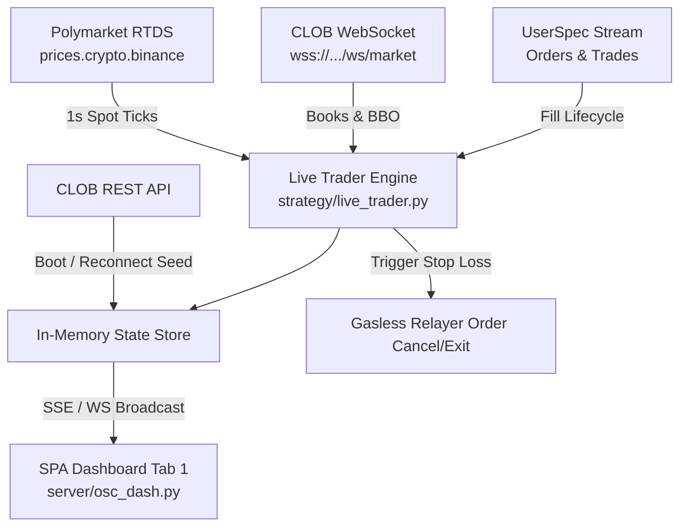

# Live Dashboard & Execution Streaming Specification

This specification documents the architecture, data protocols, and implementation blueprint for integrating real-time streaming feeds into the crypto-spread dashboard (`server/osc_dash.py`) and live trading engine (`strategy/live_trader.py`).

---

## 1. Objectives & Strategic Value
- **1s Leading Signal Detection**: Ingest 1-second cadence spot price movements directly from Binance/Chainlink RTDS feeds to anticipate Polymarket binary market shifts.
- **Fast Stop-Loss Execution**: Cancel and exit open orders before slow or stale CLOB quotes get filled when underlying spot prices breach thresholds.
- **Zero-Polling UI Updates**: Stream order book depth, trade executions, and position lifecycles directly into Tab 1 of the dashboard via WebSocket/SSE.
- **Resilient State Synchronization**: Guarantee accurate order and position tables through buffer-first, REST-reconciled boot sequences followed by event-driven state updates.

---

## 2. Stream Topics & Payload Specifications

### A. Crypto Spot Price Feed (RTDS)
- **Primary Topic**: `prices.crypto.binance`
- **Supported Symbols**: `btcusdt`, `ethusdt`, `solusdt`, `xrpusdt` *(Note: BNB is not supported on Binance or Chainlink RTDS topics; BNB uses REST fallback)*.
- **Oracle / TWAP Topic**: `prices.crypto.chainlink` (symbols: `btc/usd`, `eth/usd`, `sol/usd`, `xrp/usd`).
- **Python Subscription**:
  ```python
  from polymarket import AsyncPublicClient
  from polymarket.streams import CryptoPricesSpec

  async with AsyncPublicClient() as client:
      async with await client.subscribe(
          CryptoPricesSpec(
              topic="prices.crypto.binance",
              symbols=["btcusdt", "ethusdt", "solusdt", "xrpusdt"],
          )
      ) as stream:
          async for event in stream:
              # event.payload.symbol, event.payload.value, event.payload.timestamp
              handle_spot_tick(event.payload)
  ```
- **Payload Structure**:
  ```typescript
  type PriceUpdatePayload = {
    symbol: string;
    timestamp: number; // EpochMilliseconds
    value: string;     // DecimalString (e.g. "65420.50")
  };
  ```

### B. Multi-Market Order Book Stream (CLOB)
- **Endpoint**: `wss://ws-subscriptions-clob.polymarket.com/ws/market`
- **Subscription Type**: `MarketSpec` with single-connection multi-token array.
- **Events & State Model**:
  - `book`: Full order book snapshot. Replaces local book state entirely (do not apply as delta).
  - `price_change`: Level mutations. Updates individual price levels from `price_changes` delta list.
  - `last_trade_price`: Tape trade updates.
  - `tick_size_change`: Tick sizing updates.
- **Custom Features**: Enable `custom_feature_enabled=True` to receive `best_bid_ask`, `new_market`, and `market_resolved`.
- **Keepalive**: Send text `PING` every 10 seconds; receive `PONG`.

### C. User Orders & Trades Stream (`UserSpec`)
- **Python Subscription (Authenticated)**:
  ```python
  import os
  from polymarket import AsyncSecureClient
  from polymarket.clob_types import ApiCreds
  from polymarket.streams import UserSpec

  creds = ApiCreds(
      api_key=os.environ["CLOB_API_KEY"],
      api_secret=os.environ["CLOB_API_SECRET"],
      api_passphrase=os.environ["CLOB_API_PASSPHRASE"],
  )
  async with AsyncSecureClient(
      key=os.environ["POLYGON_PRIVATE_KEY"],
      creds=creds,
      chain_id=137,
  ) as client:
      async with await client.subscribe(UserSpec()) as stream:
          async for event in stream:
              if event.type == "order":
                  # event.payload.order_event_type: PLACEMENT | UPDATE | CANCELLATION
                  # event.payload.status: LIVE | MATCHED | CANCELED | DELAYED | UNMATCHED
                  update_order_table(event.payload)
              elif event.type == "trade":
                  # event.payload.status: MATCHED → CONFIRMED
                  update_position_table(event.payload)
  ```
- **Order Status Reducer Rules**:
  - `LIVE`: Order resting actively on book; display in open orders table.
  - `DELAYED`: Order awaiting matching engine processing; flag as pending.
  - `UNMATCHED`: Order rejected or resting without execution; display status or clear.
  - `MATCHED`: Fully filled; prune from open orders and transition to position state.
  - `CANCELED`: Canceled; prune from open orders table.

---

## 3. Dashboard Integration Architecture (`server/osc_dash.py`)

### Data Flow Diagram


### Versioned Dashboard Event Envelope
All updates broadcast from `StateStore` to the frontend use a versioned envelope schema:
```typescript
type DashboardEnvelope<T> = {
  version: "1.0";
  type: "snapshot" | "delta";
  stream_id: "spot" | "books" | "orders" | "positions";
  seq: number;
  server_time: number;
  data: T;
};
```
- **Replay/Resume Contract**: The frontend tracks the last observed `seq`. On reconnect or gap detection (`seq > last_seq + 1`), the frontend requests a full `type: "snapshot"` refresh.

### State Synchronization Lifecycle
1. **Initial Boot / Page Load (Buffer-First)**:
   - Connect WebSocket streams and immediately begin buffering incoming events into a queue.
   - Concurrently request REST snapshots from `/orders` and `/positions`.
   - Once REST snapshots return, populate base state store.
   - Replay and reconcile buffered WebSocket events against base state using order/trade ID and monotonic timestamp ordering.
2. **Live Ingestion**:
   - Mutate in-memory order table keyed by `payload.id`.
   - Update position status as trades progress `MATCHED` `→` `CONFIRMED`.
3. **Reconnection & Failover**:
   - When socket disconnects, set dashboard UI indicator to `RECONNECTING`.
   - On socket recovery, buffer incoming events, re-fetch REST snapshots, and reconcile base state before resuming delta streaming.

---

## 4. UI Dashboard Components (Tab 1 Additions)
1. **Spot Signal Latency Tracker**: Real-time ticker showing delta between RTDS 1s spot tick and CLOB implied probability.
2. **Live Order Execution Matrix**: Table displaying live orders, matched fills, and cancellation states with zero page reload.
3. **Automated Stop-Loss Status**: Visual alert indicator showing active leading-tick monitors and fast exit triggers.
